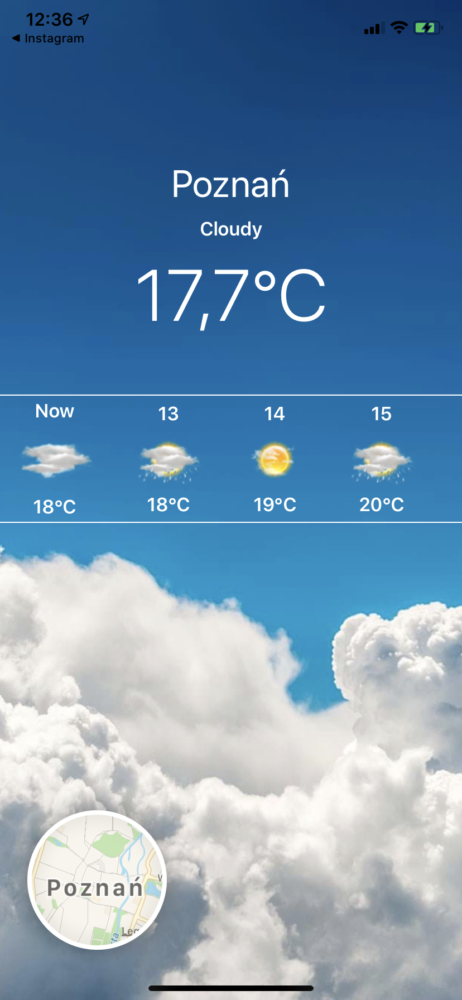
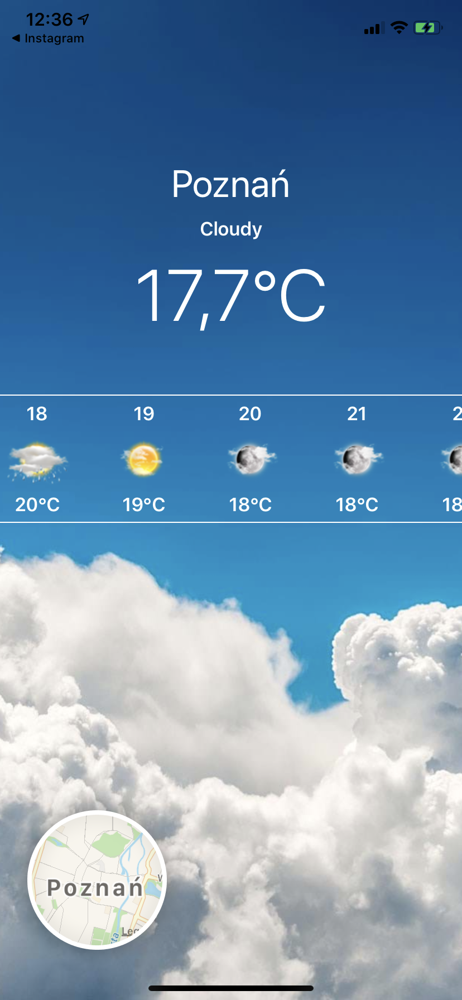
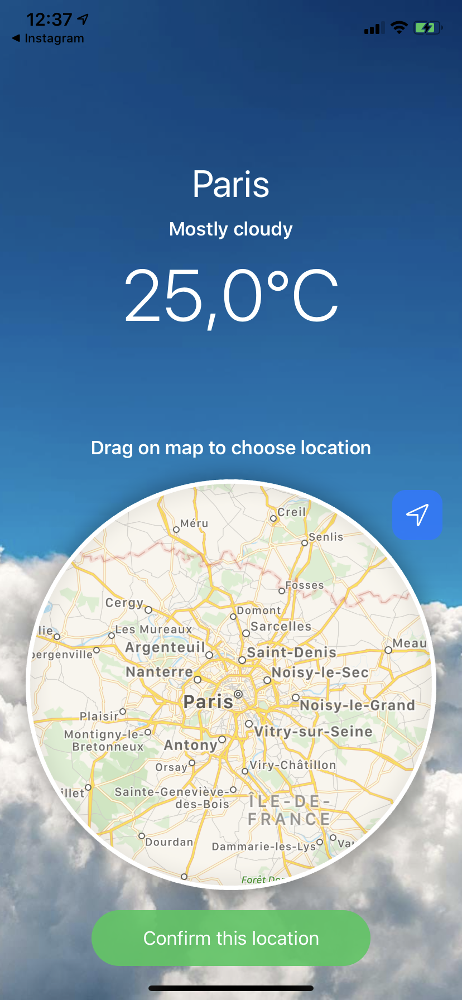
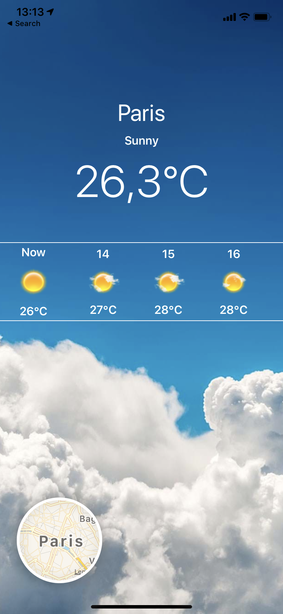

# SwiftUI-Weather-App

Weather app based on MapKit, CoreLocation, SwiftUI, AccuWeaher API. At start app locating user and download current weather conditions and twelve hour weather forecast from AccuWeather. All download data are coded in JSON and app decodig it to get all needed informations, also weather icons are download in right moment directly from AccuWeather. User can also choose location from map, it's easy and convenient. Tap on map to open location picker, drag map to specific location that weather forecast interest you and confirm that location with button. Current weather condidtions are presentet in top area of app, twelve hour forecast are presented in horizontal scrollview. That's all. 

 <h3>Few screenshots</h3>
  
  
  
  
